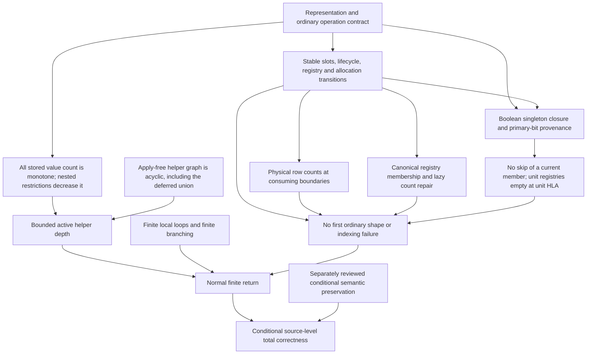

# Dependencies of the canonical and Boolean occurrence totality claims

Audit date: 2026-09-06. Source coordinates refer to the unchanged
`R/CnfFormula_simplify.R`, SHA-256
`7d34ad60035509a463168752bb5f6f82d87fd7182a94a0e48461be7cdbe35fdc`.

The arrows below indicate proof dependencies, not function calls. The basic
transition lemmas are a simultaneous induction on already executed finite
prefixes. Their induction hypothesis is the previous boundary state, or the
explicit pending write inside a repair block. It is not normal return of the
current invocation.



`C` is the canonical HLA branch. `O -> U` replaces it for homogeneous
Boolean occurrences. The semantic theorem has additional dependencies below;
there is no arrow from semantic preservation back to `L`, `B`, `Q`, or `U`.
Ordinary primitive totality and sufficient resources are included in `R` when
deducing `N`.

## 1. Minimal common source lemmas

| Lemma | Source-level facts required | What it supplies |
| --- | --- | --- |
| Stable actual storage | Sorting at 48 is a permutation. The only later actual range/list writes are 103, 167 and 244. Each uses the then-current entry and occurs before inference callbacks. Elimination flags only change to TRUE. | Fixed original indices, no restoration by a resumed old snapshot, and monotonic actual ranges. |
| Lifecycle | Initial units have one captured queue visit; only physical nonunit-to-singleton conversion can later register an index. Registry cleanup precedes recursive registration. Call sites at 135, 506, 322 and 467 either supply a live nonunit or return on the absent symbol of a stale other-symbol unit. | One unit representative per domain binding; stable `available` inverses; no explicit unit-deletion `stop`. |
| Allocation and fixed columns | Active outer matrices are allocated before callbacks. A future active matrix can be NULL; guards at 118/133/176/261 handle it. Counts certify initialized pairs, and diagonal counts stay NA. Frozen names contain every retained name. | Valid numeric coordinates and named accesses, including stale snapshots. |
| Physical bookkeeping | Pair construction sums rows. A guarded bit flip repairs its count before a callback. Column removal saves exactly the TRUE initialized rows. Reentrant forward loops recheck the bit. | Counts zero, one and two mean zero, one and two physical TRUE positions. This needs no interpretation of the bits as logical containment. |
| Consuming call-site guards | Activity/count/pivot guards are refreshed after recursion; `!is.na` removes intentional NA candidates before `[[`; helper results are Boolean or explicitly handled NULL. | Defined scalar tests, selected scalar names, valid target/donor indices and argument shapes. |
| HLA isolation | A target uses its own row in each donor matrix. Only that target can be eliminated. The self row stays FALSE. A nonbreaking iteration marks its selected unused donor used. | Valid local donor coordinates, current-target counts, and bounded `repeat` loops. |

The lifecycle and bookkeeping assertions require the documented transition
boundaries. At 244--251 a singleton is pending registration. At 474--477 an
eliminated target is pending registry cleanup. Between a bit write and its
count repair the count differs by the specified pending delta. No relevant
inference consumer runs in those intervals. The next primitive repair is
justified by stable coordinates rather than by pretending equality already
holds.

For a first-error argument, consider the first invalid consuming operation.
The preceding finite prefix either ends at a maintained boundary or is inside
one of these explicit finite repair sequences. The corresponding next-step
lemma supplies its argument shape. This rules out that first operation.
An induction may use the actual return value of a child that has already
returned in the prefix; it may not assume return of an active child. The
inspected lifecycle and result-status arguments respect that distinction.

## 2. The two HLA indexing branches

For canonical inputs, registry membership is exact and names are unique.
Line 738 therefore equals the TRUE count of the row defined by
`names(donor) != unitsymbol`. Every decrement at 774 first constructs that
row and only clears a TRUE bit. An unallocated row cannot have been
decremented. These physical facts suffice to select one scalar name at 753.
They do not require proof that the row is a semantically exact comparison.

For Boolean occurrences, use the following independent sequence.

1. Actual ranges remain homogeneous singletons. A nonempty strict range
   update is impossible. After matrix allocation there is no registry
   reinsertion. A current registry member has not lost an occurrence of that
   symbol since its registration.
2. For a currently registered candidate, a primary candidate-to-unit FALSE
   bit can only originate from an explicit equal-singleton comparison.
   That comparison also clears the reverse primary bit. Restoring that
   reverse bit to TRUE would require removing the candidate's symbol, which
   clears all its current membership. Pair initialization cannot run during
   an active propagation frame. Thus the saved unit column and current
   candidate column cannot satisfy the asymmetric skip test for a current
   member.
3. Each current member in a captured propagation snapshot is either made
   inactive or loses registry membership on its actual visit. Later duplicate
   snapshot visits can skip orphans. They cannot restore membership.
   Preprocessing may register a nonunit afresh, but only after applying its
   captured unit-symbol list. While that current clause remains a nonunit,
   it cannot generate a new nested unit with matrices still NULL.
4. If a finite prefix reaches unit HLA, the earlier synchronous propagation
   frames in that prefix have already returned. Its current unit-symbol
   registries are empty. Nonunit HLA can only remove further registrations.
5. Every surviving donor has physical width at least two. Its count at 738
   is exactly its full width. Selection at 745 is NA and 746 breaks. Lines
   747--784, including lazy-row construction and forcing `roe_inverse`, are
   unreachable for each unit target.

This argument does not need grouped semantic containment or the orphan-birth
lemma. Orphan birth is a dependency of the Boolean semantic theorem instead:
an orphan at cache birth could defeat the claim that every orphan has a
permanent trailing TRUE column. Keeping those dependencies separate removes
a tempting but unnecessary apparent cycle through semantic preservation.

## 3. A weaker termination bound with fewer dependencies

The reviewed `W0` and `Phi0` bounds are sound. For bare termination there is
an even simpler fallback. Define the mathematical natural number

```
Q(entries) = sum over all original stored slots i,
              and physical literal positions j in entries[[i]],
              of length(entries[[i]][[j]]).
```

Include eliminated slots. This is not a count of live clauses, fibers,
comparisons, callbacks, or semantically distinct literals. Let `Q0` be its
initial value.

The source writes prove monotonicity without a semantic premise:

* At 103, a unit intersection replaces its then-current range by a subset.
* At 167, the local clause was read from current storage; only leaf
  operations occurred since that read. The assigned intersection is
  nonempty and strictly shorter.
* At 244, the local clause was read from current storage; no inference
  callback intervened. A present nonempty range has been removed.
* Flag changes do not change `Q`. The HLA assignments at 722 and 784 are
  local virtual-clause writes, not writes to `entries`.

Take consecutive active restriction frames A and B. Before A can have B as
a restriction descendant, A must pass through 167 or through the deletion
write at 244. Its absent-symbol, unchanged-range, whole-target deletion and
empty-clause contradiction paths cannot call a further restriction. The
deferred `char_union` forced through `char_intersect` is a leaf operation.
Consequently `Q(entry B) < Q(entry A)` in the already executed prefix.

This gives at most `Q0 + 1` active restriction frames. Removing the restriction
vertex from the inspected helper graph, and adding the dynamic deferred
`char_intersect -> char_union` edge, leaves an acyclic graph whose longest
path has five vertices. Therefore

```
active local helper depth <= 6*Q0 + 11.
```

Counting eliminated slots deliberately removes target liveness as an
additional *descent* premise. Lifecycle is still required for indexing and
source-call admissibility. Counting concrete stored values removes membership
fiber closure and signature freezing from this elementary termination proof.
The resulting bound is weaker and may depend on domain and symbol counts.
It is a fallback, not a proposed replacement for the reviewed sharper bounds.

For homogeneous Boolean occurrences `Q0` equals physical occurrence width
`W0`. The Boolean proof's separate edge-cut argument is also sound: remove
the unreachable nonempty-range-update edges, then cut the deletion helper's
edges to registration and pair callbacks. Every cut edge follows the strict
write at 244. The remaining graph is acyclic; our conservative static graph
has longest path six, so the stated bound `13*(W0+1)` has ample slack.

Bounded depth alone does not prove termination. All local `for` loops visit
finite captured sequences; child recursion cannot lengthen that sequence.
The HLA `repeat` loops either exit or mark an unused donor. There are finite
primitive operations between loop iterations and child calls. Thus every
helper vertex has finitely many children, independently of whether an active
child is initially imagined to return. A finite-height, finitely branching
tree is finite by induction on height. The top level supplies finitely many
roots. This closes the termination argument before invoking semantic
preservation.

## 4. Optional refinements and semantic dependencies

The original `W0` improvement uses original membership fibers. Every stored
range is a union of whole original fibers, and strict live changes remove a
fiber occurrence. This is a source-prefix closure lemma about the actual
set operations. It does not require the whole output to preserve truth.

The `Phi0` improvement additionally uses the large-signature-class first-change
lemma. Before a first change at a group of at least three symbols, every
exceptional group column remains TRUE: initialization tests actual inclusion;
updates at other names cannot touch the group; there is no group-symbol unit;
and HLA cannot write an actual expanded range. Physical row counts then rule
out selecting a group member with one or two exceptions. This local lemma
applies to an unfinished invocation even though the enclosing repeated-pass
theorem is stated for normally completed calls. Neither the repeated-pass
conclusion nor semantic correctness is needed for the substitution.

The canonical semantic theorem imports stronger facts than shape safety:
live unit representatives justify contextual FALSE certificates; chronological
birth certificates use strictly older constraints; reaching HLA discharges
those certificates as physical containment; current-target HLA comparisons
and lazy-row semantic exactness justify each deletion. A boundary reached
after completed propagation is a property of the completed prefix, not of
future whole-function return.

The Boolean semantic theorem instead needs orphan-birth and permanent trailing
columns, grouped containment before HLA and in the current virtual HLA target,
and the separate equal-name SSE2 case split. Its unit-HLA argument imports the
structural no-start lemma in Section 2, so no unit used as an assumption is
subsequently deleted in that phase. These stronger semantic lemmas are applied
to the normal returned computation only after safety and termination have
established that such a return occurs.

The canonical explicit helper-count `B(m)`, `D(m)` and finite-tree sum are
optional cost refinements. Their finite snapshot-size bounds come from
canonical registry uniqueness and at most one registration per original
clause. Boolean occurrence snapshots have finite occurrence-dependent length,
but their size is unbounded at fixed original clause count. None of the
canonical clause-only child/root estimates is needed for Boolean totality.
